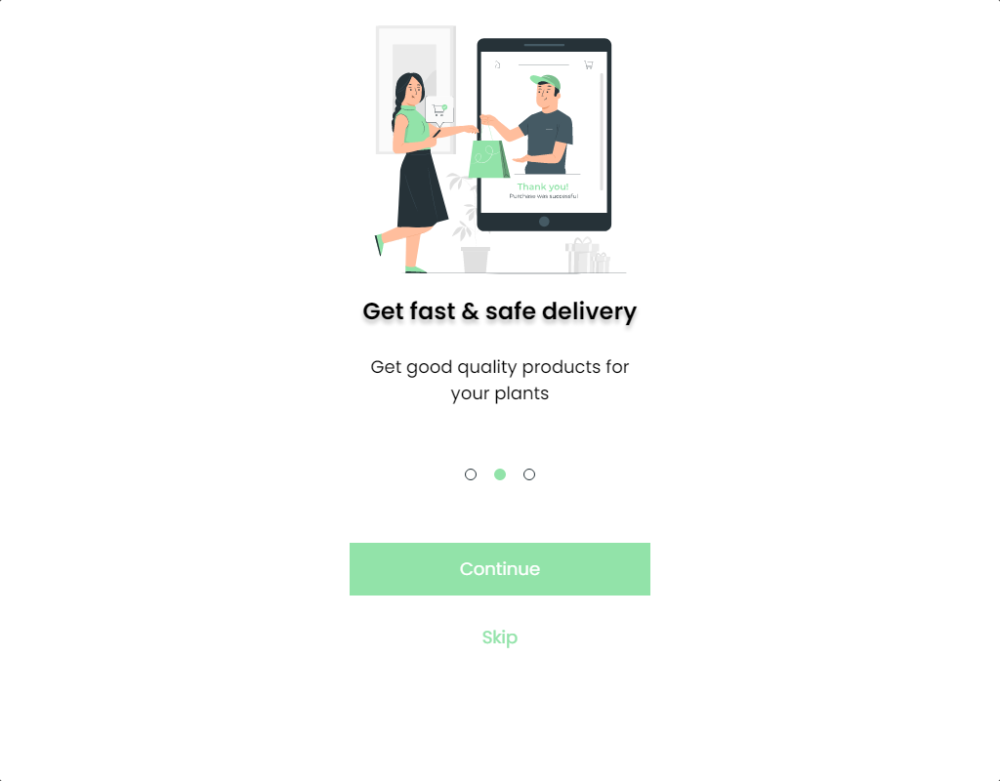

    

## Projeto Onboarding
- O objetivo do projeto Onboarding é construir 3 telas conforme o layout do Figma, utilizando **HTML5** e **SCSS**. Para facilitar, utilizei um plugin para capturar fotos das medidas de responsividade mais utilizdas. Você pode consultar todas as prints geradas por esse link.

## 👩‍💻 Tecnologias
- 

- 

- 

## 🧾 Instruções 

- [X] Projeto responsivo, de mobile a desktop.
- [X] Utilizando HTML e CSS (pode usar o SASS e o JS pra fazer mudança de tela)
- [X] Manter a fonte utilizada no figma
- [X] Manter as imagens utilizadas no figma
- [X] O botão continue deve levar para a tela seguinte
- [X] O botão skip deve sempre direcionar para a ultima tela
- [X] O projeto deve ser salvo no git
- [X] Commits descritivos e coerentes com o que está sendo feito

## 🏗 To Do
- [X] Responsividade
- [X] Navegação active dos links
- [X] Acessibilidade com navegação por TAB + ENTER
- [] Deploy
