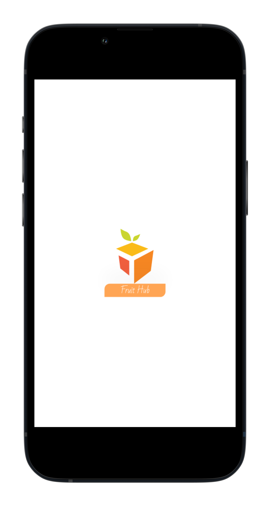
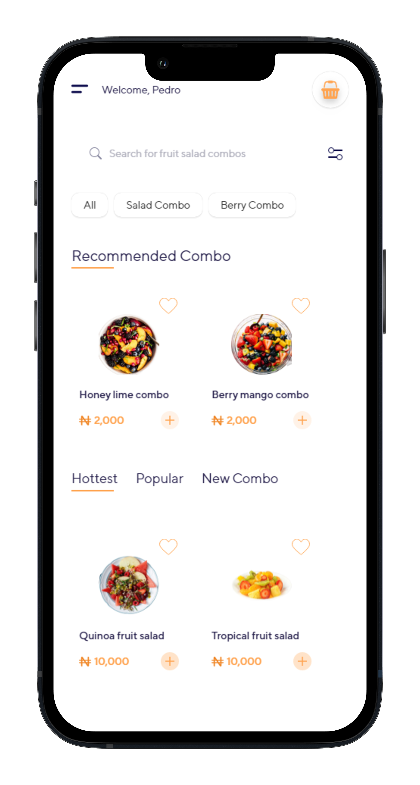
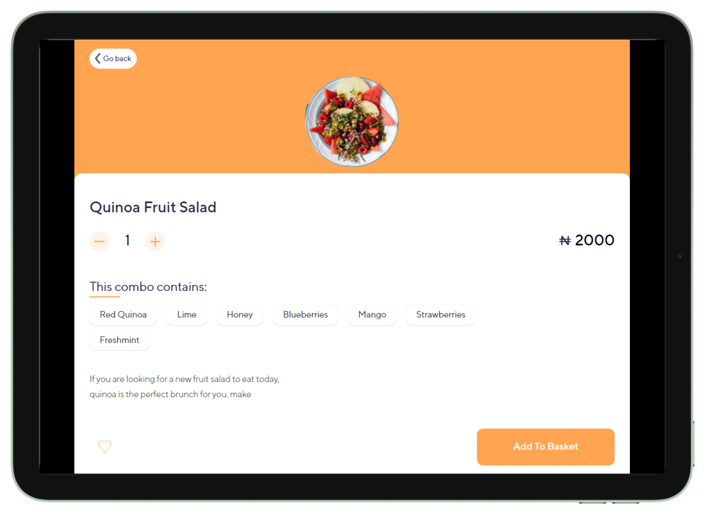

    
    
    

  <a href="#-Projeto-Onboarding"> Projeto</a>&nbsp;&nbsp;|&nbsp;&nbsp;
  <a href="#-Tecnologias">  Tecnologias</a>&nbsp;&nbsp;|&nbsp;&nbsp;
  <a href="#-Instruções">  Instruções</a>&nbsp;&nbsp;|&nbsp;&nbsp;
  <a href="#-To-Do">  To Do </a>&nbsp;&nbsp;&nbsp;&nbsp;&nbsp;

## 🥭 Projeto Fruit Hub
O objetivo do projeto FruitHub é construir 5 telas iniciais de um ecommerce, conforme o layout do Figma, utilizando **HTML5**, **JavaScript**, **SCSS**. Para facilitar a visualização da responsividade, utilizei um plugin para capturar fotos das medidas mais comuns. Você pode consultar todas as prints geradas por esse [link](./.github).

## 👩‍💻 Tecnologias
- 

- 

- 

- 

## 🧾 Instruções 

- [X] Projeto responsivo, de mobile a desktop.
- [X] Utilizando HTML e CSS (pode usar o SASS e o JS)
- [X] Manter a fonte utilizada no figma
- [X] Manter as imagens utilizadas no figma
- [X] O projeto deve ser salvo no git
- [X] Commits descritivos e coerentes com o que está sendo feito.

## 🏗 To Do
- [X] Desenvolvimento Mobile-First
- [X] Separação dos arquivos `.scss` e componentização do que se repete.
- [X] Responsividade
- [X] Tela de carregamento
- [X] Contador com JavaScript na página Basket.
- [X] LocalStorage para armazenar o nome da pessoa entre as páginas.
- [X] Acessibilidade com navegação por TAB + ENTER
- [ ] Personalizar scrollbar
- [ ] Deploy

---

<blockquote> Feito por Pedro Henrique Vinhas 🪐 </blockquote>
